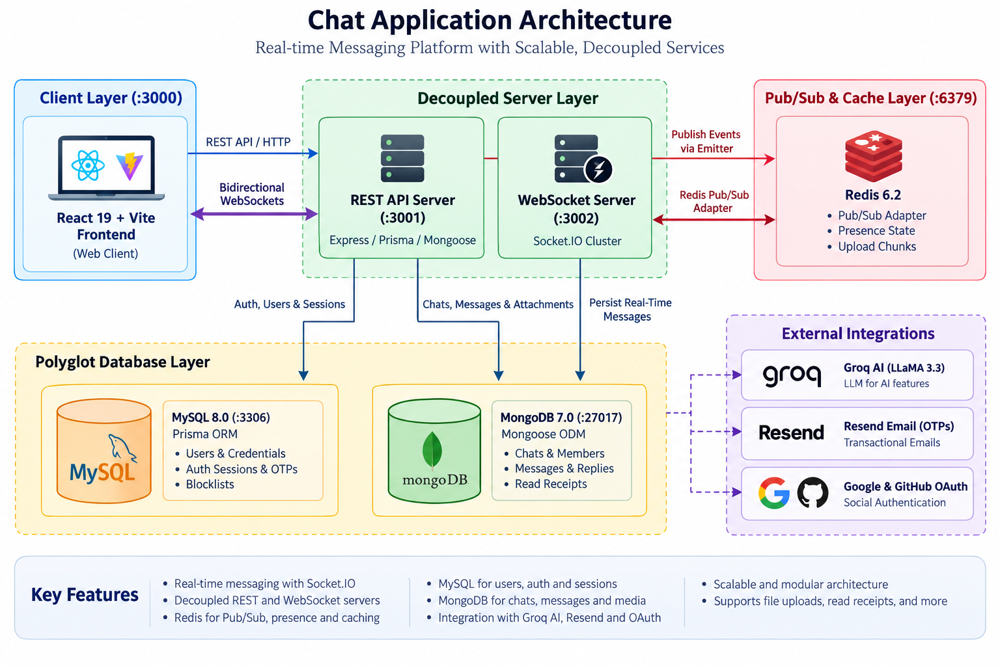

<div align="center">
  
  <h1>SwiftTalk</h1>
  <p><strong>Scalable Full-Stack Real-Time Messaging Application</strong></p>

  <p>
    
    
    
    
    
    
    
    
  </p>
</div>

---

SwiftTalk is a high-performance, real-time messaging platform built for scale. It features a **hybrid polyglot persistence architecture** (MySQL for relational identity, auth, and sessions; MongoDB for high-throughput chats, messages, and read receipts), decouples the REST API from dedicated WebSocket instances scaled via Redis pub/sub, and integrates AI assistance, web push notifications, and OAuth.

---

## ✨ Key Features

- **Real-Time Messaging**: Instant delivery, live typing indicators, delivery & read receipts, and presence via Socket.IO.
- **Message Replies & Context**: Interactive reply chaining with embedded snapshots and click-to-scroll navigation.
- **Polyglot Persistence**: **MySQL (Prisma)** for strict ACID user identity & auth; **MongoDB (Mongoose)** for high-throughput chats & messages.
- **Decoupled WebSocket Architecture**: Standalone WebSocket server (`:3002`) isolated from the REST API (`:3001`), horizontally scaled via Redis.
- **AI-Powered Assistance**: Smart replies, chat summarization, and message translation powered by Groq (LLaMA 3.3).
- **Chunked File Transfers**: Large file transfers sliced into Redis buffer caches and assembled asynchronously.
- **Direct & Group Chats**: 1-on-1 private messaging and multi-member group chats with admin moderation.
- **Robust Authentication**: JWT access & refresh token rotation, email OTP verification, and OAuth 2.0 (Google & GitHub).

---

## 🏗️ Architecture & Services

<p align="center">
  
</p>

| Service              | Port    | Technology                | Purpose                                    |
| :------------------- | :------ | :------------------------ | :----------------------------------------- |
| **Frontend Client**  | `3000`  | React 19, Vite            | Responsive web application UI              |
| **REST API Server**  | `3001`  | Express, Prisma, Mongoose | Auth, users, chats, messages, AI, uploads  |
| **WebSocket Server** | `3002`  | Socket.IO, Redis Adapter  | Real-time messaging, presence, receipts    |
| **Redis**            | `6379`  | Redis 6.2                 | Pub/Sub broker, presence, & message cache  |
| **MySQL Database**   | `3306`  | MySQL 8.0 (Prisma)        | Users, credentials, sessions, OTPs, blocks |
| **MongoDB Database** | `27017` | MongoDB 7.0 (Mongoose)    | Chats, messages, attachments, receipts     |

---

## 🚀 Quick Start

### Option 1: Docker Compose

```bash
# 1. Clone repository and setup environment
git clone https://github.com/RushiK8626/SwiftTalk-Chat-Messaging-App.git
cd SwiftTalk-Chat-Messaging-App
cp server/.env.example server/.env
cp client/.env.example client/.env

# 2. Spin up all services
docker compose up -d
```

Access the client at **http://localhost:3000**.

### Option 2: Local Development

**Prerequisites**: Node.js 18+, MySQL 8.0, MongoDB 7.0+, and Redis 6.2+.

```bash
# 1. Install dependencies
cd server && npm install
cd ../client && npm install
cd ..

# 2. Configure environment
cp server/.env.example server/.env
cp client/.env.example client/.env

# 3. Synchronize database schemas
cd server
npm run db:generate
npm run db:push

# 4. Start backend (runs REST API on :3001 and WS on :3002 concurrently)
npm run dev

# 5. Start frontend (in a separate terminal)
cd ../client
npm start
```

---

## ⚙️ Key Scripts

| Command               | Working Directory | Description                                      |
| :-------------------- | :---------------- | :----------------------------------------------- |
| `npm run dev`         | `/server`         | Runs API (`:3001`) and WS (`:3002`) concurrently |
| `npm run dev:api`     | `/server`         | Runs REST API server only                        |
| `npm run dev:ws`      | `/server`         | Runs WebSocket server only                       |
| `npm run db:generate` | `/server`         | Generates Prisma Client types                    |
| `npm run db:push`     | `/server`         | Synchronizes MySQL schema with Prisma            |
| `npm start`           | `/client`         | Starts Vite development server (`:3000`)         |
| `npm run build`       | `/client`         | Builds frontend production bundle                |

---

## 📄 License

This project is licensed under the [ISC License](LICENSE).
